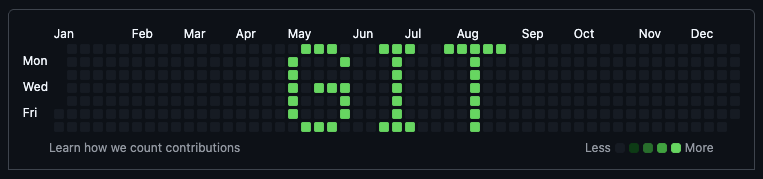
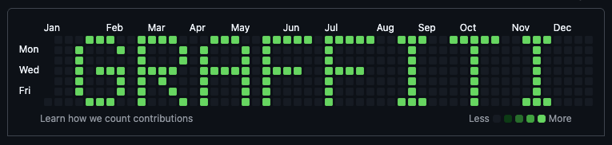
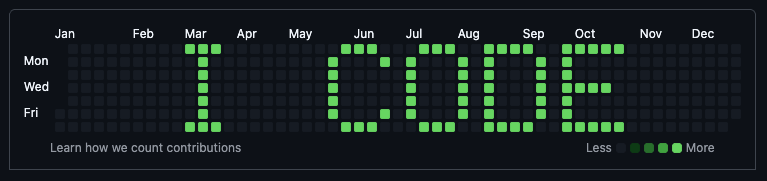
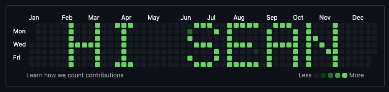

# gitgraffiti

Paint words on your GitHub contribution graph.




## How it works

Your GitHub profile shows a grid of green squares — one per day, darker = more commits. gitgraffiti treats this grid as a 7×52 pixel display, renders your text with a built-in pixel font, and creates backdated commits on the right days. Push to any repo on your account and your profile spells out whatever you want.



## Usage

```bash
# Preview without making any commits
python3 gitgraffiti.py "HELLO" --dry-run

# Write to your profile
python3 gitgraffiti.py "HIRE ME" --repo git@github.com:you/some-repo.git --year 2024
```

## Options

| Flag | Description | Default |
|------|-------------|---------|
| `--repo URL` | GitHub repo to push to | _(none, prints instructions)_ |
| `--year YYYY` | Target year | Current year |
| `--intensity N` | Commits per active cell | 1 |
| `--spacing N` | Blank columns between letters | 1 |
| `--align` | `left`, `center`, or `right` | `center` |
| `--dry-run` | Preview the grid, don't commit | |



## Tips

- Works best on a **year with no existing commits** — otherwise your text will blend into the noise
- Use a **dedicated empty repo** for this — you don't want lots of fake commits in a real project
- The graph is 52 columns wide. Most 5-6 letter words fit comfortably; 8 is the max
- If your profile already has commits that year, bump `--intensity` so the text stands out
- Use `--spacing 0` to squeeze in longer text
- Supports A-Z, 0-9, and a few symbols: `! - . _ #`

## Use with an AI agent

If you use [Claude Code](https://claude.ai/code), Codex, or another AI coding agent, just clone this repo and ask your agent to use it. The included `CLAUDE.md` and `AGENTS.md` files give your agent everything it needs to preview text, create a repo, and push the commits for you.

```
> use gitgraffiti to write "HIRE ME" on my 2023 github profile
```

## Requirements

Python 3.6+ and git. No dependencies.
